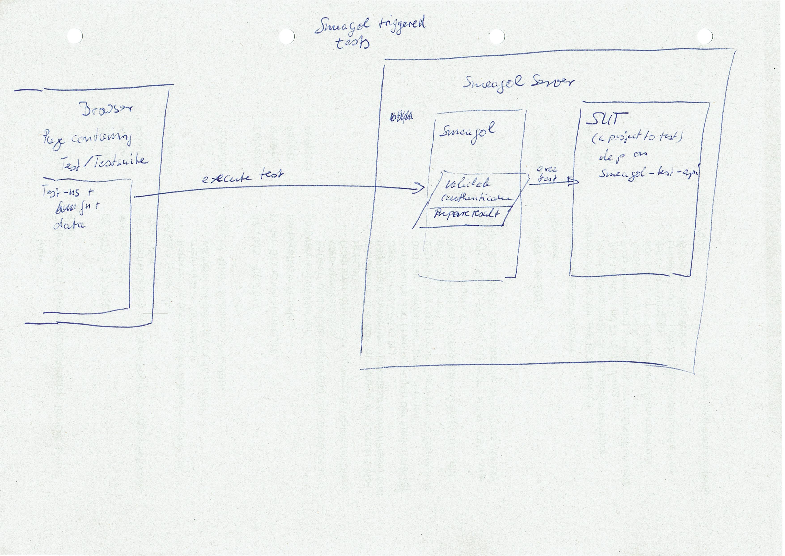

# Test-View

## access to uploaded content is not working:

## modes

### ci/headless

- application includes both smeagol and datatest dependencies
- ci script includes usual `(clojure.test/run-tests)`
- target/datatest with `**/*edn` created each file contains `{:input .. :expectation .. :output ..}`
- ci script includes a (smeagol.ci/collect-test-results ??)
- smeagol fn submits `*edn` files 1) into remote storage?! 2) processes into md + edn and commits into the git right away

### webserver

- smeagol is configured with at least 1 repository directory path, containing content `md`s *and* url/port of running nrepl into actuall app instance
- if port configured doesn't listen smeagol starts a process with nrepl on the port
- page contains a button "run" and both inputs and outputs (expected)
- on press "run" `test backticks`  are processed by submitting `:input` into nrepl
- result is rendered with actual results received